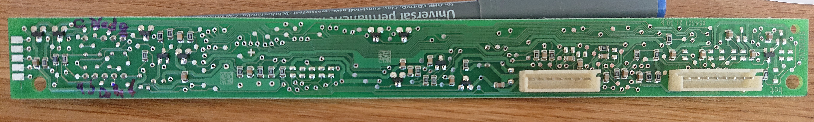

# Ernergiewende_FD8407
Meine kleine Enwegiewende mit Kühlschrank

# Motivation

Vorsicht Netzspannung! Kühlschrank vor Experimenten aus der Steckdose ziehen.

Da hat man einen Carport und Platz für Solarzellen. Nun gut, prima für die Elektrokarre. Aber halt, die steht ja wenn die Sonne scheint auf dem Parkplatz auf Arbeit... Also hat sich die Industrie ausgedacht, dass man ja einen teuren Batteriespeicher kaufen kann. Die Kosten kriegt man nur seeehr selten wieder rein. Momentan ist das eher noch eine ideologisch motivierte Kaufentscheidung.

Aber halt, wir haben ja einen Speicher im Haus... einen Kältespeicher. Nein, sogar zwei. Kühlschrank und Kühltruhe. Jetzt müsste man den nur einschalten, wenn ein Überschuss da ist und ausschalten, wenn beispielsweise die Lebensmittel zu doll gefrieren oder die Karre wieder da ist und geladen werden will.

Damit wird gekühlt, wenn ein Leistungsüberschuss da ist. Und dann wird wenn die Sonne weg ist wieder in den Normalbetrieb gewechselt. Es wird dann langsam wieder wärmer (in Richtung der üblichen eingestellten Temperatur). Klar, dass durch eine größere Temperaturdifferenz zwischen Innenraum des Kühlschranks und Außen auch größere Verluste gibt. Aber so schlecht ist die Isolation nun auch wieder nicht und bevor ich den Strom quasi der Allgemeinheit schenke (sieben Cent Einspeisevergütung pro kWh) oder fürs Speichern draufzahle.... Laut [Datenblatt](https://media3.bsh-group.com/Documents/eudatasheet/de-LU/KI26E440.pdf) ist die Lagerzeit bei Störungen 18h.

Doof nur, dass der Kühlschrank absolut nicht intelligent ist. Das Ding ist nun einmal knapp zwanzig Jahre alt, tut aber noch prima seinen Dienst. Zum Wegschmeißen zu schade und abgeschrieben ist er auch. Solange er läuft gehts nicht billiger... Also muss das Ding irgendwie aufgeschlaut werden. 

Garantie gibt's eh keine mehr. Also hält sich die Scham in Grenzen. Auf geht's :) Als Elektroingenieur gilt hier das Pippi-Langstrumpf-Prinzip: Ich mache mir die Welt, widdewiesiemirgefällt.

# Das Gerät

Die beschrieben ist die Kiste schon etwas älter. Gefreut habe ich mich über das altmodische "c" bei den Electrogeräten auf dem Typschild:  


Und ohne viel drumherum ist hier ein Bild der Steuereinheit, die oben am Kühlschrank sitzt:  


Zu erkennen sind verschiedene Bedientaster, eine Siebensegmentanzeige, LEDs und der Hauptschalter. Sonst gibt es noch die Temperatursensoren (NTC), die im Innenraum sitzen und den Türsensor, der durch das Loch am rechten Rand der Bedieneinheit ragt. 

# Lösungsmöglichkeiten

## Kompressor manuell schalten

Mit einem Schütz kann man beispielsweise die Netzspannung, die normalerweise von der Elektronik geschaltet wird, trennen und mit einem zweiten Schütz stumpf Netzspannung dauerhaft aufschalten solange man Leistungsüberschuss hat.

Diese Lösung hat aber eigentlich nur Nachteile... Leistungsschütze-/Schalter sind nicht gerade günstig und man setzt damit auch die Überwachung des Kompressors durch die Elektronik außer Kraft. Einen Controller zum Steuern braucht man auch noch.

## Elektronik einspannen

Der Kühlschrank hat ein Bedienpanel, das üblicherweise nicht zugänglich ist, weil die Tür geschlossen ist. An die Elektronik kommt man aber dann doch recht leicht ran, weil diese nicht von der Dichtung eingeschlossen ist, d.h. sie ist nicht im Kühlraum. Also keine Undichtigkeiten durch Kabel, die nach draußen geführt werden müssen (WLAN Empfang im Kühlschrank ist eher schlecht...).

Einen Controller zum Steuern (z.B. über WLAN) braucht man eh (s.o.), es liegt also nahe, diesem auch Bedienaufgaben zu übertragen. Also muss eine Lösung gefunden werden, wie der Controller die Knöpfe bedienen kann und die aktuellen Einstellungen lesen kann.

# Lösung durch Elektronik einspannen

Tja.. was brauchts dafür? Und wie geht man vor?

- Der Kühlschrank hat eine "Super"-Taste. Diese aktiviert für eine gewisse Zeit eine Dauer-Tiefkühlfunktion.  
- Die Solltemperaturen für den Kühl- und Gefrierbereich können getrennt eingestellt werden.

Erstmal ein Blick auf die Platine
Oberseite, dem Nutzer zugewandt wenn er in den Kühlschrank schaut:


Ohhh... es gibt nen Controller. Der ist allerdings Siemens-Spezial. Nichts, was man irgendwo sonst findet. Custom silicon, wie es aussieht. Doof. Also scheidet eine alternative Firmware wohl aus. Aber es gibt einen (seriellen?) Port zu Wartungszwecken (sauber abgesichert mit Dioden und Serienwiderständen, das waren noch Zeiten...) an der linken Seite der Platine (von oben gesehen). Der spuckt allerdings nichts aus. Und auch ein Aktivieren des Service-Modus (Super-Taste beim Einschalten drücken) führt nicht zu Aktivität auf dem Port. Wartet wohl auf ein Magic Packet o.ä. Schade...

Tja, da muss dann wohl der Hardware-Weg beschritten werden mit einer Bediensimulation... Ich will ja nicht immer wenn die Sonne scheint am Kühlschrank rumtippen müssen. (Die Variante "wir machen mal ne neue Platine" lasse ich bewusst außen vor, da ich nun wirklich nicht die Zeit und Lust dafür habe.)

Sonst finden sich noch allerlei (kleine) Transistoren, ein Darlington-Treiber (ULN2004) für die Siebensegmentanzeige, ein EEPROM, ein (Negativ-)Spannungsregler für -5V und Hühnerfutter... 

Unterseite:


Stecker 2,54mm Raster zur Anbindung an die Leistungselektronik und die Sensoren. Vorsicht: der weiße Draht im achtpoligen Stecker führt Netzspannung (Türschalter). Um unnötige spannende (haha) Momente zu vermeiden rate ich zu "Finger weg..." und entsprechenden Schutzmaßnahmen.


Bei der Super-Taste sagt die Bedienungsanleitung, dass sich die Funktion irgendwann selbst wieder deaktiviert, wenn das neu eingelegte Zeugs im TK-Bereich durchgefroren ist. Ich tippe auf eine Auswertung des Temperaturgradienten, um den Punkt mitzukriegen. Anderenfalls deaktiviert sie sich spätestens nach einem Tag wieder. Hm. Kein neues Zeug im TK-Bereich führt wahrscheinlich dazu, dass sich die Funktion ziemlich bald wieder deaktiviert. Man kann es aber mal probieren.   
- Vorteil: Zeug im Kühlbereich friert nicht ein, die Temperatur dort bleibt gleich. Schnell zu aktivieren, ein Taster mit Optokoppler brücken. Auswertung ob aktiviert oder nicht ist auch einfach, da es eine LED dafür gibt. Lässt sich ebenfalls mit Optokoppler gut auswerten. Ein Input, ein Output am Controller. Da reicht was echt kleines (z.B. ESP-01). Optokoppler sind Cent-Bausteine. Plus einen Vorwiderstand für den Optokopper. EspEasy auf den Controller, das wars. 
- Nachteil: Siehe oben, die Funktion deaktiviert sich ggfs. selbst und kann dann ggfs. auch nicht wieder aktiviert werden. Auswertung bei geschlossener Tür schwierig, da die LED ausgeschaltet wird wenn die Tür zu ist.


Etwas mehr Einflussmöglickeiten hat man mit der getrennten Einstellung von Kühl- und Gefriertemperatur. 
- Vorteil: Getrennte Regelmöglichkeiten für Kühl- und Gefrierbereich. Genaue Einstellung der Temperatur.
- Nachteil: Der Taster zur Temperatureinstellung geht zyklisch durch die Temperatur. Da muss man schon höllisch aufpassen, dass man da nicht außer Tritt gerät mit den Einstellungen. Also muss die Siebensegmentanzeige ausgewertet werden. Und ggfs. noch die LED daneben (ändert sich, je nach, ob Freezer oder Cooler Temperatur eingestellt/angezeigt wird). Uff. Das macht schonmal mindestens sieben Optokoppler für eine Siebensegmentanzeige (naja, Cent...) aber braucht auch ordentlich Platz (WAF, der Kühlschrank soll ja nicht allzu sehr verbastelt aussehen ;) ).

# Fazit:

Als Quick Fix tut es wohl erstmal die Super-Taste. Dazu reicht auch ein Optokoppler, da die Stromaufnahme ja sowieso mit einem sogenannten Smart Meter (SDM630) gemessen wird. Da sieht man die Zyklen vom Kühlschrank (von 00:00 bis 08:30). Danach sind die weg, weil die E-Karre bei ausreichendem Sonnenschein zum Laden geschaltet wurde. Ab 14:30 hört die Ladung auf (Karre voll), dann gehts rund mit dem Cos Phi (es waren auch Leute zu Hause, sonst wäre die Karre ja nicht da gewesen)...


# Bonus

Weil ich es eh' gemacht habe kommt hier noch etwas Doku zur Siebensegmentanzeige. Vorweg: Die beiden Ziffern werden im  Multiplex angesteuert. Das spart Leitungen vom Controller. Datenblatt zur Anzeige konnte ich keines finden, also war Messen angesagt. Deswegen sind die Bezeichnungen der Pins auch (etwas, hüstel) unorthodox. Der Multiplex funktioniert stumpf über die Auswahl der Anode. Wenn dort Spannung anliegt, werden die Segmente durch den ULN2004 in Richtung Masse (oder was immer das auf der Platine so ist, Vorsicht... ) geschaltet. Die zwei Anoden werden also über zwei Transistoren abwechselnd mit Spannung versorgt und dann werden einfach die gewünschten Segmente ausgewählt. Also nix mit extra Pin für die Auswahl der Ziffer. Das erklärt auch, warum die Anzeige (nur) neun (2x Anode, 7x Segment) statt zehn (1x Anode, 2x Mux-Pin zur Auswahl der Ziffer, 7x Segment) Pins hat.

Pinout am uC:
- uc_23: Uln_in7
- uc_24: Uln_in6
- uc_25: Uln_in5
- uc_26: Uln_in4
- uc_27: Uln_in3
- uc_28: Uln_in2
- uc_29: Uln_in1
- uc_35: Anode Zehnerstelle ("b") via Transistortreiber
- uc_37: Anode Einerstelle ("e") via Transistortreiber


## Wir basteln uns ein Interface mit CPLD

Im Keller liegen noch einige 5V CPLDs von Xilinx (XC9536). Da lässt sich sicher was machen. Und die gute alte ISE gibts auch als virtuelle Maschine für Windows. Das Ding scheint allerdings nicht so richtig durchdacht. Also verbringen wir erstmal einige Zeit mit Fehlersuche beim Floor Planning für den CPLD (pace-tool lässt sich nicht starten. Bei click auf den Punkt in der ISE passiert einfach nix).

Pace liegt im Pfad ``/opt/Xilinx/14.7/ISE_DS/bin/lin64``, Name der ausführbaren Datei ist ``pace_old``. 

Uff, was für ein Linux läuft denn da in der VM?
```
[ise@localhost ISE_DS]$ lsb_release -a
LSB Version:	:base-4.0-amd64:base-4.0-noarch:core-4.0-amd64:core-4.0-noarch:graphics-4.0-amd64:graphics-4.0-noarch:printing-4.0-amd64:printing-4.0-noarch
Distributor ID:	OracleServer
Description:	Oracle Linux Server release 6.4
Release:	6.4
Codename:	n/a
```

- http://svenand.blogdrives.com/comments?id=59 (``export DISPLAY=:0`` ) in ``/opt/Xilinx/14.7/ISE_DS/settings64.sh `` 
- https://forums.xilinx.com/t5/FPGA-Configuration/Xilinx-issues-on-Linux/td-p/194576 (generell hilfreich)
- https://www.philipzucker.com/install-webpack-ise-14-7-ubuntu-spartan-ax309-fpga-board/ (Fonts installieren)
  - System -> Administration -> Add/Remove Software
  - Das Root Passwort ist ``xilinx``
  - Eigentlich hängt die VM nicht im Netz, aber da wir eh' Software laden, können wir auch ein Sicherheitsupdate fahren: Klappt nicht.
 
 Am Ende scheitere ich noch immer (hat jemand US-UTF Fonts?):
 ```
 [ise@localhost lin64]$ pace_old
Wind/U Error (193): X-Resource: DefaultGUIFontSpec (-adobe-courier-medium-o-normal--12-120-75-75-m-70-iso8859-2) does not fully specify a font set for this locale
Segmentation fault (core dumped)
```
 
 Nach zwei Stunden kommt der Punkt wo ich einfach sagen muss "leckt mich". Also eine ebenfalls uralte CD im Keller ausgebuddelt mit einer ISE6.1 für native Windows. Prima: CPLD, Virtex2/3 Spartan 2/3 alles da :)
 
 Xilinx Environment Variable auf ``c:\Xilinx`` in einer DOS-Box von Hand gesetzt und ``c:\xilinx\bin\nt\pace.exe`` gestartet. Haha... Das gute alte Ding, ich habs vermisst.
 
 
 
 
 
 
 Alternativ gibts da noch Lösungen mit Docker, die wohl ansatzweise funktionieren?
 - https://github.com/zberkes/XilinxISE-Docker
 - http://homepages.hs-bremen.de/~jbredereke/en/software/xilinx-docker/index.html


 Mit etwas quetschen kriege ich nun ein schönes Ergebnis :)  
 ```
 ******************************  Device Pin Out *****************************

Device : XC9536-15-PC44


   --------------------------------  
  /6  5  4  3  2  1  44 43 42 41 40 \
 | 7                             39 | 
 | 8                             38 | 
 | 9                             37 | 
 | 10                            36 | 
 | 11        XC9536-15-PC44      35 | 
 | 12                            34 | 
 | 13                            33 | 
 | 14                            32 | 
 | 15                            31 | 
 | 16                            30 | 
 | 17                            29 | 
 \ 18 19 20 21 22 23 24 25 26 27 28 /
   --------------------------------  


Pin Signal                         Pin Signal                        
No. Name                           No. Name                          
  1 S7<3>                            23 GND                           
  2 S7<4>                            24 BCDOut<1>                     
  3 S7<5>                            25 BCDOut<2>                     
  4 S7<6>                            26 BCDOut<3>                     
  5 TIE                              27 BCDOut<4>                     
  6 TIE                              28 BCDOut<5>                     
  7 TIE                              29 BCDOut<6>                     
  8 TIE                              30 TDO                           
  9 TIE                              31 GND                           
 10 GND                              32 VCC                           
 11 TIE                              33 TIE                           
 12 TIE                              34 TIE                           
 13 TIE                              35 TIE                           
 14 TIE                              36 Anode_1                       
 15 TDI                              37 Anode_10                      
 16 TMS                              38 S7<0>                         
 17 TCK                              39 TIE                           
 18 TIE                              40 TIE                           
 19 TIE                              41 VCC                           
 20 TIE                              42 TIE                           
 21 VCC                              43 S7<1>                         
 22 BCDOut<0>                        44 S7<2>                         


Legend :  NC  = Not Connected, unbonded pin
         PGND = Unused I/O configured as additional Ground pin
         TIE  = Unused I/O floating -- must tie to VCC, GND or other signal
         VCC  = Dedicated Power Pin
         GND  = Dedicated Ground Pin
         TDI  = Test Data In, JTAG pin
         TDO  = Test Data Out, JTAG pin
         TCK  = Test Clock, JTAG pin
         TMS  = Test Mode Select, JTAG pin
  PROHIBITED  = User reserved pin
 ```

Zwischenzeitlich habe ich auch die Chips gefunden und eine Demo-Platine, die ich irgenwann mal (Usenet de.sci.ing.elektrotechnik lässt grüßen) von jemandem geätzt bekommen habe. Nicht schön, aber selten und hat einen JTAG Programmierheader, den ich damals über einen Parallelport-Adapter angesteuert habe. Jetzt habe ich einen Digilent HS-3, das Ding ist kleiner als die Demo-Platine und kein Vergleich mit den ollen Xilinx-Originalen von damals. 


